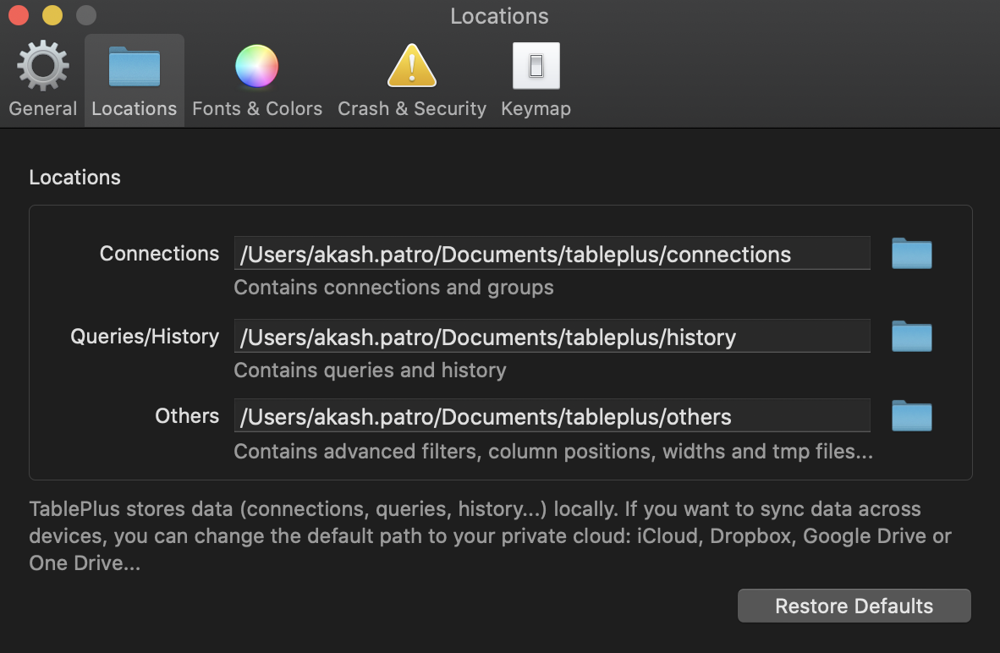

# Sync with iCloud

Tableplus stores all your database configurations and files locally. It doesn’t have a remote syncing functionality built-in. Painful to add each of the database configs if you have multiple workstations.

[Why Tableplus don't want to build a remote sync feature](https://github.com/TablePlus/TablePlus/issues/390#issuecomment-625830262)

[However, they suggest a way to configure a two-way sync. This approach can be followed for remote storage service like iCloud drive and Dropbox.](
https://github.com/TablePlus/TablePlus/issues/390#issuecomment-625830262)

## 1. Create these folders
   
```sh
 mkdir -p ~./Documents/tableplus/connections
 mkdir -p ~./Documents/tableplus/history
 mkdir -p ~./Documents/tableplus/others
```

## 2. Copy table plus connections settings to newly created folder

```sh
cp ~/Library/Application\ Support/com.tinyapp.TablePlus/Data/Connections.plist ~./Documents/tableplus/connections/Connections.plist

cp ~/Library/Application\ Support/com.tinyapp.TablePlus/Data/ConnectionGroups.plist ~./Documents/tableplus/connections/ConnectionGroups.plist
```

## 3. Goto table plus > Preferences > Locations and update the locations.

